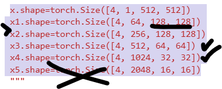

To adjust a pre-trained ResNet-50 model to output a specific shape, such as `[4, 64, 512, 512]`, you can modify the model to stop at a particular layer by altering the network architecture. Here's how you can adapt ResNet-50 to output `x1.shape = torch.Size([4, 64, 512, 512])` when the input `x` is of shape `[4, 1, 512, 512]`:

python

```
import torch
import torchvision.models as models
import torch.nn as nn

class CustomResNet(nn.Module):
    def __init__(self):
        super(CustomResNet, self).__init__()
        self.resnet = models.resnet50(pretrained=True)  # Load the pre-trained ResNet-50 model
        self.resnet = nn.Sequential(*list(self.resnet.children())[:-4])  # Remove layers after 'layer1'
    
    def forward(self, x):
        x = self.resnet(x)
        return x

# Create an instance of the modified ResNet model
custom_resnet = CustomResNet()

# Initialize an input tensor
x = torch.randn(4, 1, 512, 512)  # Input tensor of shape [4, 1, 512, 512]

# Forward pass to obtain the desired output shape
x1 = custom_resnet(x)
print("x1.shape =", x1.shape)  # Expected shape: [4, 64, 512, 512]
```

In this script, a custom ResNet model is defined by loading the pre-trained ResNet-50 and then removing the layers following `layer1` to limit the model's capacity. This modified model is then used to process an input tensor `x` with shape `[4, 1, 512, 512]`, resulting in an output tensor `x1` with the desired shape `[4, 64, 512, 512]`.

This approach enables you to extract feature maps from an intermediate layer of ResNet-50 and customize the model to end at a specific point within the architecture, providing the desired output shape.


### Input figure shape (grey)

x.shape=torch.Size([4, 1, 512, 512])


## Encoder

### U net encoder architecture

x1.shape=torch.Size([4, 64, 128, 128])
x2.shape=torch.Size([4, 256, 128, 128])
x3.shape=torch.Size([4, 512, 64, 64])
x4.shape=torch.Size([4, 1024, 32, 32])
x5.shape=torch.Size([4, 2048, 16, 16])


### Resnet50

**We suppose that the input height and width is 224x224. It can be replaced with other shapes, however the last two channels’ dimensions will change accordingly.** 

**The output channel dimension is assumed to be the number of classes on the ImageNet, which is 1,000. It can also be changed with additional fully connected layers.** 


**conv1**: 64 -> 64
Conv2d(3, 64, kernel_size=(7, 7), stride=(2, 2), padding=(3, 3), bias=False)
**bn1**
BatchNorm2d(64, eps=1e-05, momentum=0.1, affine=True, track_running_stats=True)
**relu**
ReLU(inplace=True)
**maxpool**
MaxPool2d(kernel_size=3, stride=2, padding=1, dilation=1, ceil_mode=False)


**layer1**:  **64–> 256**
Sequential(
  (0): Bottleneck(
    (conv1): Conv2d(64, 64, kernel_size=(1, 1), stride=(1, 1), bias=False)
    (bn1): BatchNorm2d(64, eps=1e-05, momentum=0.1, affine=True, track_running_stats=True)
    (conv2): Conv2d(64, 64, kernel_size=(3, 3), stride=(1, 1), padding=(1, 1), bias=False)
    (bn2): BatchNorm2d(64, eps=1e-05, momentum=0.1, affine=True, track_running_stats=True)
    (conv3): Conv2d(64, 256, kernel_size=(1, 1), stride=(1, 1), bias=False)
    (bn3): BatchNorm2d(256, eps=1e-05, momentum=0.1, affine=True, track_running_stats=True)
    (relu): ReLU(inplace=True)
    (downsample): Sequential(
      (0): Conv2d(64, 256, kernel_size=(1, 1), stride=(1, 1), bias=False)
      (1): BatchNorm2d(256, eps=1e-05, momentum=0.1, affine=True, track_running_stats=True)
    )
  )
  (1): Bottleneck(
    (conv1): Conv2d(256, 64, kernel_size=(1, 1), stride=(1, 1), bias=False)
    (bn1): BatchNorm2d(64, eps=1e-05, momentum=0.1, affine=True, track_running_stats=True)
    (conv2): Conv2d(64, 64, kernel_size=(3, 3), stride=(1, 1), padding=(1, 1), bias=False)
    (bn2): BatchNorm2d(64, eps=1e-05, momentum=0.1, affine=True, track_running_stats=True)
    (conv3): Conv2d(64, 256, kernel_size=(1, 1), stride=(1, 1), bias=False)
    (bn3): BatchNorm2d(256, eps=1e-05, momentum=0.1, affine=True, track_running_stats=True)
    (relu): ReLU(inplace=True)
  )
  (2): Bottleneck(
    (conv1): Conv2d(256, 64, kernel_size=(1, 1), stride=(1, 1), bias=False)
    (bn1): BatchNorm2d(64, eps=1e-05, momentum=0.1, affine=True, track_running_stats=True)
    (conv2): Conv2d(64, 64, kernel_size=(3, 3), stride=(1, 1), padding=(1, 1), bias=False)
    (bn2): BatchNorm2d(64, eps=1e-05, momentum=0.1, affine=True, track_running_stats=True)
    (conv3): Conv2d(64, 256, kernel_size=(1, 1), stride=(1, 1), bias=False)
    (bn3): BatchNorm2d(256, eps=1e-05, momentum=0.1, affine=True, track_running_stats=True)
    (relu): ReLU(inplace=True)
  )
)

**layer2:  **  **256–>512 **
Sequential(
  (0): Bottleneck(
    (conv1): Conv2d(256, 128, kernel_size=(1, 1), stride=(1, 1), bias=False)
    (bn1): BatchNorm2d(128, eps=1e-05, momentum=0.1, affine=True, track_running_stats=True)
    (conv2): Conv2d(128, 128, kernel_size=(3, 3), stride=(2, 2), padding=(1, 1), bias=False)
    (bn2): BatchNorm2d(128, eps=1e-05, momentum=0.1, affine=True, track_running_stats=True)
    (conv3): Conv2d(128, 512, kernel_size=(1, 1), stride=(1, 1), bias=False)
    (bn3): BatchNorm2d(512, eps=1e-05, momentum=0.1, affine=True, track_running_stats=True)
    (relu): ReLU(inplace=True)
    (downsample): Sequential(
      (0): Conv2d(256, 512, kernel_size=(1, 1), stride=(2, 2), bias=False)
      (1): BatchNorm2d(512, eps=1e-05, momentum=0.1, affine=True, track_running_stats=True)
    )
  )
  (1): Bottleneck(
    (conv1): Conv2d(512, 128, kernel_size=(1, 1), stride=(1, 1), bias=False)
    (bn1): BatchNorm2d(128, eps=1e-05, momentum=0.1, affine=True, track_running_stats=True)
    (conv2): Conv2d(128, 128, kernel_size=(3, 3), stride=(1, 1), padding=(1, 1), bias=False)
    (bn2): BatchNorm2d(128, eps=1e-05, momentum=0.1, affine=True, track_running_stats=True)
    (conv3): Conv2d(128, 512, kernel_size=(1, 1), stride=(1, 1), bias=False)
    (bn3): BatchNorm2d(512, eps=1e-05, momentum=0.1, affine=True, track_running_stats=True)
    (relu): ReLU(inplace=True)
  )
  (2): Bottleneck(
    (conv1): Conv2d(512, 128, kernel_size=(1, 1), stride=(1, 1), bias=False)
    (bn1): BatchNorm2d(128, eps=1e-05, momentum=0.1, affine=True, track_running_stats=True)
    (conv2): Conv2d(128, 128, kernel_size=(3, 3), stride=(1, 1), padding=(1, 1), bias=False)
    (bn2): BatchNorm2d(128, eps=1e-05, momentum=0.1, affine=True, track_running_stats=True)
    (conv3): Conv2d(128, 512, kernel_size=(1, 1), stride=(1, 1), bias=False)
    (bn3): BatchNorm2d(512, eps=1e-05, momentum=0.1, affine=True, track_running_stats=True)
    (relu): ReLU(inplace=True)
  )
  (3): Bottleneck(
    (conv1): Conv2d(512, 128, kernel_size=(1, 1), stride=(1, 1), bias=False)
    (bn1): BatchNorm2d(128, eps=1e-05, momentum=0.1, affine=True, track_running_stats=True)
    (conv2): Conv2d(128, 128, kernel_size=(3, 3), stride=(1, 1), padding=(1, 1), bias=False)
    (bn2): BatchNorm2d(128, eps=1e-05, momentum=0.1, affine=True, track_running_stats=True)
    (conv3): Conv2d(128, 512, kernel_size=(1, 1), stride=(1, 1), bias=False)
    (bn3): BatchNorm2d(512, eps=1e-05, momentum=0.1, affine=True, track_running_stats=True)
    (relu): ReLU(inplace=True)
  )
)
**layer3: 512 -> 1024**
Sequential(
  (0): Bottleneck(
    (conv1): Conv2d(512, 256, kernel_size=(1, 1), stride=(1, 1), bias=False)
    (bn1): BatchNorm2d(256, eps=1e-05, momentum=0.1, affine=True, track_running_stats=True)
    (conv2): Conv2d(256, 256, kernel_size=(3, 3), stride=(2, 2), padding=(1, 1), bias=False)
    (bn2): BatchNorm2d(256, eps=1e-05, momentum=0.1, affine=True, track_running_stats=True)
    (conv3): Conv2d(256, 1024, kernel_size=(1, 1), stride=(1, 1), bias=False)
    (bn3): BatchNorm2d(1024, eps=1e-05, momentum=0.1, affine=True, track_running_stats=True)
    (relu): ReLU(inplace=True)
    (downsample): Sequential(
      (0): Conv2d(512, 1024, kernel_size=(1, 1), stride=(2, 2), bias=False)
      (1): BatchNorm2d(1024, eps=1e-05, momentum=0.1, affine=True, track_running_stats=True)
    )
  )
  (1): Bottleneck(
    (conv1): Conv2d(1024, 256, kernel_size=(1, 1), stride=(1, 1), bias=False)
    (bn1): BatchNorm2d(256, eps=1e-05, momentum=0.1, affine=True, track_running_stats=True)
    (conv2): Conv2d(256, 256, kernel_size=(3, 3), stride=(1, 1), padding=(1, 1), bias=False)
    (bn2): BatchNorm2d(256, eps=1e-05, momentum=0.1, affine=True, track_running_stats=True)
    (conv3): Conv2d(256, 1024, kernel_size=(1, 1), stride=(1, 1), bias=False)
    (bn3): BatchNorm2d(1024, eps=1e-05, momentum=0.1, affine=True, track_running_stats=True)
    (relu): ReLU(inplace=True)
  )
  (2): Bottleneck(
    (conv1): Conv2d(1024, 256, kernel_size=(1, 1), stride=(1, 1), bias=False)
    (bn1): BatchNorm2d(256, eps=1e-05, momentum=0.1, affine=True, track_running_stats=True)
    (conv2): Conv2d(256, 256, kernel_size=(3, 3), stride=(1, 1), padding=(1, 1), bias=False)
    (bn2): BatchNorm2d(256, eps=1e-05, momentum=0.1, affine=True, track_running_stats=True)
    (conv3): Conv2d(256, 1024, kernel_size=(1, 1), stride=(1, 1), bias=False)
    (bn3): BatchNorm2d(1024, eps=1e-05, momentum=0.1, affine=True, track_running_stats=True)
    (relu): ReLU(inplace=True)
  )
  (3): Bottleneck(
    (conv1): Conv2d(1024, 256, kernel_size=(1, 1), stride=(1, 1), bias=False)
    (bn1): BatchNorm2d(256, eps=1e-05, momentum=0.1, affine=True, track_running_stats=True)
    (conv2): Conv2d(256, 256, kernel_size=(3, 3), stride=(1, 1), padding=(1, 1), bias=False)
    (bn2): BatchNorm2d(256, eps=1e-05, momentum=0.1, affine=True, track_running_stats=True)
    (conv3): Conv2d(256, 1024, kernel_size=(1, 1), stride=(1, 1), bias=False)
    (bn3): BatchNorm2d(1024, eps=1e-05, momentum=0.1, affine=True, track_running_stats=True)
    (relu): ReLU(inplace=True)
  )
  (4): Bottleneck(
    (conv1): Conv2d(1024, 256, kernel_size=(1, 1), stride=(1, 1), bias=False)
    (bn1): BatchNorm2d(256, eps=1e-05, momentum=0.1, affine=True, track_running_stats=True)
    (conv2): Conv2d(256, 256, kernel_size=(3, 3), stride=(1, 1), padding=(1, 1), bias=False)
    (bn2): BatchNorm2d(256, eps=1e-05, momentum=0.1, affine=True, track_running_stats=True)
    (conv3): Conv2d(256, 1024, kernel_size=(1, 1), stride=(1, 1), bias=False)
    (bn3): BatchNorm2d(1024, eps=1e-05, momentum=0.1, affine=True, track_running_stats=True)
    (relu): ReLU(inplace=True)
  )
  (5): Bottleneck(
    (conv1): Conv2d(1024, 256, kernel_size=(1, 1), stride=(1, 1), bias=False)
    (bn1): BatchNorm2d(256, eps=1e-05, momentum=0.1, affine=True, track_running_stats=True)
    (conv2): Conv2d(256, 256, kernel_size=(3, 3), stride=(1, 1), padding=(1, 1), bias=False)
    (bn2): BatchNorm2d(256, eps=1e-05, momentum=0.1, affine=True, track_running_stats=True)
    (conv3): Conv2d(256, 1024, kernel_size=(1, 1), stride=(1, 1), bias=False)
    (bn3): BatchNorm2d(1024, eps=1e-05, momentum=0.1, affine=True, track_running_stats=True)
    (relu): ReLU(inplace=True)
  )
)
**layer4: 1024 -> 2048**
Sequential(
  (0): Bottleneck(
    (conv1): Conv2d(1024, 512, kernel_size=(1, 1), stride=(1, 1), bias=False)
    (bn1): BatchNorm2d(512, eps=1e-05, momentum=0.1, affine=True, track_running_stats=True)
    (conv2): Conv2d(512, 512, kernel_size=(3, 3), stride=(2, 2), padding=(1, 1), bias=False)
    (bn2): BatchNorm2d(512, eps=1e-05, momentum=0.1, affine=True, track_running_stats=True)
    (conv3): Conv2d(512, 2048, kernel_size=(1, 1), stride=(1, 1), bias=False)
    (bn3): BatchNorm2d(2048, eps=1e-05, momentum=0.1, affine=True, track_running_stats=True)
    (relu): ReLU(inplace=True)
    (downsample): Sequential(
      (0): Conv2d(1024, 2048, kernel_size=(1, 1), stride=(2, 2), bias=False)
      (1): BatchNorm2d(2048, eps=1e-05, momentum=0.1, affine=True, track_running_stats=True)
    )
  )
  (1): Bottleneck(
    (conv1): Conv2d(2048, 512, kernel_size=(1, 1), stride=(1, 1), bias=False)
    (bn1): BatchNorm2d(512, eps=1e-05, momentum=0.1, affine=True, track_running_stats=True)
    (conv2): Conv2d(512, 512, kernel_size=(3, 3), stride=(1, 1), padding=(1, 1), bias=False)
    (bn2): BatchNorm2d(512, eps=1e-05, momentum=0.1, affine=True, track_running_stats=True)
    (conv3): Conv2d(512, 2048, kernel_size=(1, 1), stride=(1, 1), bias=False)
    (bn3): BatchNorm2d(2048, eps=1e-05, momentum=0.1, affine=True, track_running_stats=True)
    (relu): ReLU(inplace=True)
  )
  (2): Bottleneck(
    (conv1): Conv2d(2048, 512, kernel_size=(1, 1), stride=(1, 1), bias=False)
    (bn1): BatchNorm2d(512, eps=1e-05, momentum=0.1, affine=True, track_running_stats=True)
    (conv2): Conv2d(512, 512, kernel_size=(3, 3), stride=(1, 1), padding=(1, 1), bias=False)
    (bn2): BatchNorm2d(512, eps=1e-05, momentum=0.1, affine=True, track_running_stats=True)
    (conv3): Conv2d(512, 2048, kernel_size=(1, 1), stride=(1, 1), bias=False)
    (bn3): BatchNorm2d(2048, eps=1e-05, momentum=0.1, affine=True, track_running_stats=True)
    (relu): ReLU(inplace=True)
  )
)
avgpool
AdaptiveAvgPool2d(output_size=(1, 1))
fc
Linear(in_features=2048, out_features=1000, bias=True)




```bash
x.shape=torch.Size([4, 1, 512, 512])
x1.shape=torch.Size([4, 64, 512, 512])
x2.shape=torch.Size([4, 128, 256, 256])   
x3.shape=torch.Size([4, 256, 128, 128])   #resnet50 layer 1
x4.shape=torch.Size([4, 512, 64, 64])     #resnet50 layer 2
x5.shape=torch.Size([4, 1024, 32, 32])    #resnet50 layer 3
```


```python
# load pretrained resnet50
model=models.resnet50(pretrained=True)
# dont' train the pretrain mode
model.eval()

# create learnable layer 1:
# input dimension: [N=4, 1, H=512, W=512], output dimension: [N=4, 64, H=512, W=512]
conv1=nn.Conv2d(1, 64, kernel_size=3, stride=1,padding=1, bias=True)
bn1=model.bn1
maxpool1=nn.MaxPool2d(kernel_size=3, stride=1, padding=1, dilation=1, ceil_mode=False)
layer1=torch.nn.Sequential(conv1,bn1, maxpool1)

#create learnable layer 2:
# input dimension: [N=4, 64, H=512, W=512], output dimension: [N=4, 128, H=256, H=256]
conv2=nn.Conv2d(64, 128, kernel_size=3, stride=1, padding=1, bias=True)
bn2=nn.BatchNorm2d(128, eps=1e-05, momentum=0.1, affine=True, track_running_stats=True)
maxpool2=nn.MaxPool2d(kernel_size=3, stride=2, padding=1, dilation=1, ceil_mode=False)
layer2=nn.Sequential(conv2, bn2, maxpool2)

# layer 3: input dimension: [N=4, 128, H=256, H=256],
# output dimension: [4,256,128,128]
conv3=nn.Conv2d(128, 256, kernel_size=3, stride=1, padding=1, bias=True)
bn3=nn.BatchNorm2d(256, eps=1e-05, momentum=0.1, affine=True, track_running_stats=True)
maxpool3=nn.MaxPool2d(kernel_size=3, stride=2, padding=1, dilation=1, ceil_mode=False)
layer3=nn.Sequential(conv3, bn3, maxpool3)

#borrow other layers from resnet50
# layer 4: input dimension: [4,256,128,128], output dimension: [4, 512, 64, 64]
layer4=model.layer2
# layer 5: input dimension: [4, 512, 64, 64], output dimension: [4, 1024, 32, 32]
layer5=model.layer3
```


```python
# toy input data
x=torch.randn(4,1,512,512) #x:  [4, 1, 512, 512]

# forward pass of encoder layers
x1=layer1(x)     #x1: [4, 64, 512, 512]
x2=layer2(x1)    #x2: [4, 128, 256, 256]
x3=layer3(x2)    #x3: [4,256,128,128]     
x4=layer4(x3)	 #x4: [4, 512, 64, 64]
x5=layer5(x4)    #x5: [4, 1024, 32, 32]
embeddings=[x1,x2,x3,x4,x5]
```


Resnet head:

(conv1): Conv2d(3, 64, kernel_size=(7, 7), stride=(2, 2), padding=(3, 3), bias=False)

(bn1): BatchNorm2d(64, eps=1e-05, momentum=0.1, affine=True, track_running_stats=True) 

(relu): ReLU(inplace=True)
(maxpool): MaxPool2d(kernel_size=3, stride=2, padding=1, dilation=1, ceil_mode=False)


Input: [4,1, 512, 512]

**conv1**=nn.Conv2d(ch_in, ch_out, kernel_size=3, stride=1, padding=1, bias=True)

Input: [N, 1, H, W]

Output: [N,64, H, W]

**bn1**: BatchNorm2d(64, eps=1e-05, momentum=0.1, affine=True, track_running_stats=True)

Input: [N, 64, H, W]

Output: [N,64, H, W]

**maxpoo1**=MaxPool2d(kernel_size=3, stride=1, padding=1, dilation=1, ceil_mode=False)

Output: [4, 64, 256, 256]


##### layer0

```python
conv1=nn.Conv2d(1, 64, kernel_size=3, stride=1,padding=1, bias=True)
bn1=model.bn1
maxpool1=nn.MaxPool2d(kernel_size=3, stride=1, padding=1, dilation=1, ceil_mode=False)
layer0=torch.nn.Sequential(conv1,bn1, maxpool1)
x1=layer0(x)
```

x: input   [4,1,512,512]

x1: output [4, 64, 512, 512]


##### layer1

must input channel dimension 64.

input:[N,64,H,W]       

output: [N,256,H,W]


##### layer2

must input channel dimension 256.

input:[N,256,H,W]       

output: [N,512,H/2,W/2]


##### layer3

must input channel dimension 512.

input:[N,512,H,W]       

output: [N,1024,H/2,W/2]


##### layer4

must input channel dimension 1024.

input:[N,1024,H,W]       

output: [N,2048,H/2,W/2]


### U net decoder shape

d5.shape=torch.Size([4, 512, 64, 64])

d4.shape=torch.Size([4, 256, 128, 128])

d3.shape=torch.Size([4, 128, 256, 256])

d2.shape=torch.Size([4, 64, 512, 512])

d1.shape=torch.Size([4, 2, 512, 512])


#### MaxPool2d

```python
torch.nn.MaxPool2d(kernel_size, stride=None, padding=0, dilation=1, return_indices=False, ceil_mode=False)
```

Input: [N, C, H, W]

Output:[N, C, $H_\text{out}$, $W_{\text{out}}$]
$$
H_{\text {out }}=\left\lfloor\frac{H_{\text {in }}+2 * \text { padding }[0]-\text { dilation }[0] \times(\text { kernel\_size }[0]-1)-1}{\operatorname{stride}[0]}+1\right\rfloor 
$$

$$
\begin{aligned}
W_{\text {out }}=\left\lfloor\frac{W_{\text {in }}+2 * \text { padding }[1]-\text { dilation }[1] \times(\text { kernel\_size }[1]-1)-1}{\text { stride }[1]}+1\right\rfloor
\end{aligned}
$$


```python
MaxPool2d(kernel_size=3, stride=2, padding=1, dilation=1, ceil_mode=False)
```

Input: [N, C, H, W]

Output:[N, C, $\left\lceil\frac{H}{2}\right\rceil$, $\left\lceil\frac{W}{2}\right\rceil$​]

```python
MaxPool2d(kernel_size=3, stride=1, padding=1, dilation=1, ceil_mode=False)
```

Input: [N, C, H, W]

Output:[N, C, H, W​]


#### conv2d

Shape:

​    \- Input: :math:`(N, C_{in}, H_{in}, W_{in})` or :math:`(C_{in}, H_{in}, W_{in})`

​    \- Output: :math:`(N, C_{out}, H_{out}, W_{out})` or :math:`(C_{out}, H_{out}, W_{out})`, where

​     .. math::
$$
H_{out} = \left\lfloor\frac{H_{in}  + 2 \times \text{padding}[0] - \text{dilation}[0]
\times (\text{kernel\_size}[0] - 1) - 1}{\text{stride}[0]} + 1\right\rfloor
$$
​     .. math::
$$
W_{out} = \left\lfloor\frac{W_{in}  + 2 \times \text{padding}[1] - \text{dilation}[1]
\times (\text{kernel\_size}[1] - 1) - 1}{\text{stride}[1]} + 1\right\rfloor
$$


Dilation default is 1. 

```python
nn.Conv2d(ch_in, ch_out, kernel_size=3, stride=1, padding=1, bias=True),
```

$$
H_{out} = \left\lfloor\frac{H_{in}  + 2 - 1\times (3 - 1) - 1}{1} + 1\right\rfloor
=H_{in}
$$


```python
nn. Conv2d(1, 64, kernel_size=7, stride=2, padding=3, bias=False)
```

$$
H_{out} = \left\lfloor\frac{H_{in}  + 2*3 - 1\times (7 - 1) - 1}{2} + 1\right\rfloor
=\left\lfloor \frac{H_{in}+1}{2}\right\rfloor
=\left\lceil \frac{H_{in}}{2}\right\rceil
$$


#### Batchnorm

$$
y = \frac{x - \mathrm{E}[x]}{ \sqrt{\mathrm{Var}[x] + \epsilon}} * \gamma + \beta
$$

Shape:

​    \- Input: :math:`(N, C, H, W)`

​    \- Output: :math:`(N, C, H, W)` (same shape as input)

$\gamma$ and $\beta$ are learnable parameters. 

With Learnable Parameters: 

​    \>>> m = nn.BatchNorm2d(100)

Without Learnable Parameters:

​    \>>> m = nn.BatchNorm2d(100, affine=False)


#### Upsample

Shape:

​    \- Input: :math:`(N, C, W_{in})`, :math:`(N, C, H_{in}, W_{in})` or :math:`(N, C, D_{in}, H_{in}, W_{in})`

​    \- Output: :math:`(N, C, W_{out})`, :math:`(N, C, H_{out}, W_{out})`

​     or :math:`(N, C, D_{out}, H_{out}, W_{out})`, where

  .. math::
$$
D_{out} = \left\lfloor D_{in} \times \text{scale\_factor} \right\rfloor
$$
  .. math::
$$
H_{out} = \left\lfloor H_{in} \times \text{scale\_factor} \right\rfloor
$$
  .. math::
$$
W_{out} = \left\lfloor W_{in} \times \text{scale\_factor} \right\rfloor
$$


